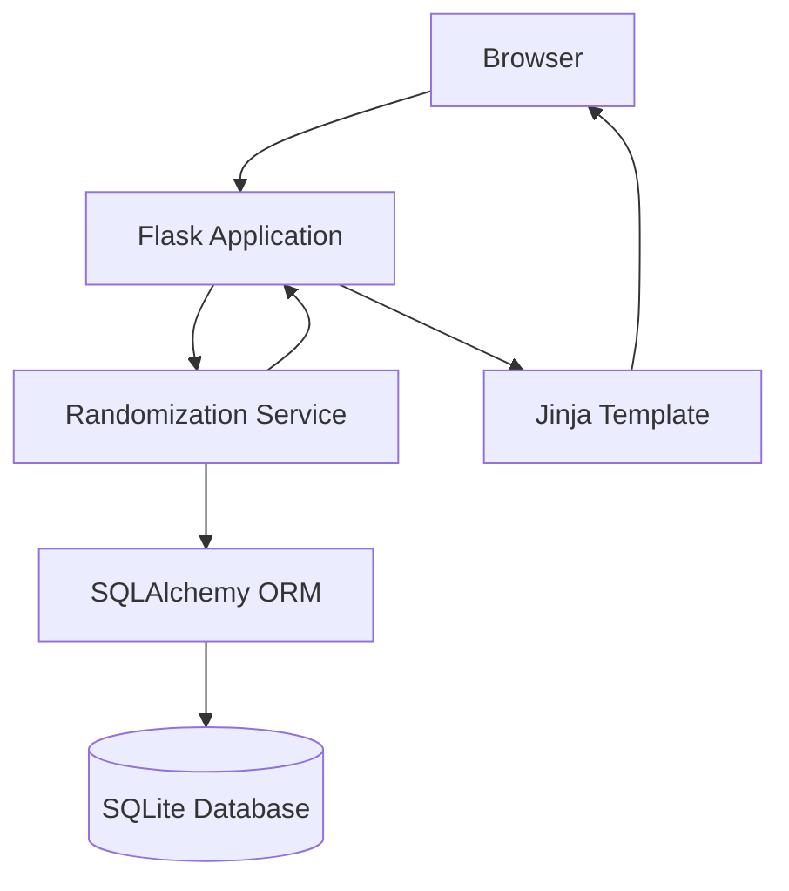

# Workout App

A database-backed web application for building, generating, tracking, and analyzing workout programs.

The project began as an upper-body workout randomizer and is evolving into a more general workout programming and tracking platform. The long-term goal is to support multiple training styles, including randomized programming, manually constructed workouts, reusable workout templates, and combinations of those approaches.

## Current Features

The application currently supports:

* A structured exercise library stored in SQLite
* Muscle groups and exercise categories
* Weekly exercise quotas
* Database-backed workout randomization
* Validation of generated workouts
* Four-day randomized workout generation
* Responsive workout display through Flask and Jinja
* SQLAlchemy ORM-based database access
* Alembic database migrations
* Persistent workout schema for training weeks, workout days, and scheduled exercises

Workout persistence and logging functionality are currently under development.

## Design Philosophy

The application separates **workout programming** from **workout execution and history**.

Programming answers:

> What workout should be created?

A workout may eventually be created through:

* Randomization
* Manual programming
* Reusable templates
* Configurable training splits
* A combination of fixed and randomized exercise selections

Persistence answers:

> What workout was actually scheduled or performed?

Once created, all workouts use the same underlying persistence and tracking system regardless of how they were programmed.

This allows the application to support different training styles without coupling workout history to a specific programming method.

## Current Application Flow



The current implementation generates a workout when the main page is requested.

The next stage of development will save generated workouts to the database so that refreshing the page loads the same scheduled workout rather than generating a new one.

## Project Structure

```text
workout_app/
├── README.md
├── docs/
│   ├── architecture.md
│   ├── database.md
│   ├── tech-stack.md
│   └── roadmap.md
├── migrations/
├── data/
│   ├── __init__.py
│   └── seed_exercises.py
├── services/
│   ├── __init__.py
│   └── randomizer.py
├── static/
│   └── style.css
├── templates/
│   ├── base.html
│   └── week.html
├── app.py
├── database.py
├── init_db.py
├── models.py
└── requirements.txt
```

## Core Data Hierarchy

The exercise library uses:

```text
MuscleGroup
    ↓
Category
    ↓
Exercise
```

Scheduled workouts use:

```text
TrainingWeek
    ↓
WorkoutDay
    ↓
WorkoutExercise
    ↓
Exercise
```

A `WorkoutExercise` references an existing `Exercise` rather than copying the exercise definition into each workout.

## Randomization

The current randomizer selects exercises according to category quotas stored in the database.

It currently:

* Selects the required number of exercises from each category
* Prevents duplicate exercises within a generated week
* Attempts to distribute exercises intelligently across workout days
* Strongly discourages duplicate categories on the same day
* Mildly discourages excessive concentration of the same muscle group
* Validates the completed schedule before returning it

The current `[5, 5, 4, 4]` day structure represents the first implemented training configuration. It is not intended to become a system-wide restriction.

Future versions will move toward configurable workout structures and randomization rules.

## Planned Programming Methods

The long-term architecture is intended to support:

```text
Exercise Library
       ↓
Program / Split Definition
       ↓
Programming Rules
       ↓
┌────────────────────────────┐
│ Randomized / Manual / Fixed│
└────────────────────────────┘
       ↓
Scheduled Workout
       ↓
Workout Logging
       ↓
History & Progress
```

For example, one user might use a fully randomized upper-body program while another uses a manually configured Push/Pull/Legs split.

A workout may also eventually combine methods, such as keeping Bench Press fixed while randomly selecting accessory exercises.

## Local Setup

Create and activate a Python virtual environment:

```bash
python3 -m venv .venv
source .venv/bin/activate
```

Install dependencies:

```bash
python -m pip install -r requirements.txt
```

Apply database migrations:

```bash
alembic upgrade head
```

Seed the exercise library when initializing a new database:

```bash
python -m data.seed_exercises
```

Run the application:

```bash
python app.py
```

The local Flask development server will normally be available at:

```text
http://127.0.0.1:5000
```

## Documentation

Additional technical documentation is available in:

* `docs/architecture.md` — application architecture and design decisions
* `docs/database.md` — database schema and relationships
* `docs/tech-stack.md` — technologies and their responsibilities
* `docs/roadmap.md` — current status and planned development

## Development Status

This project is actively under development.

The immediate focus is persistent workout scheduling, followed by manual workout editing and workout/set logging.
