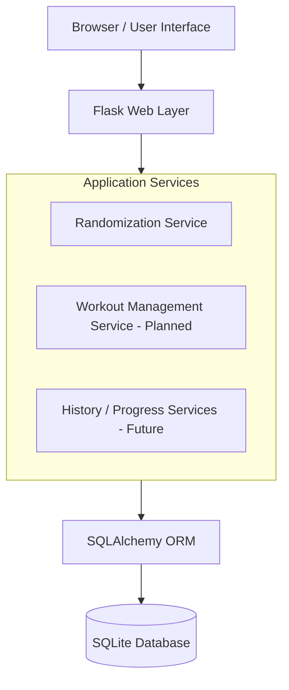
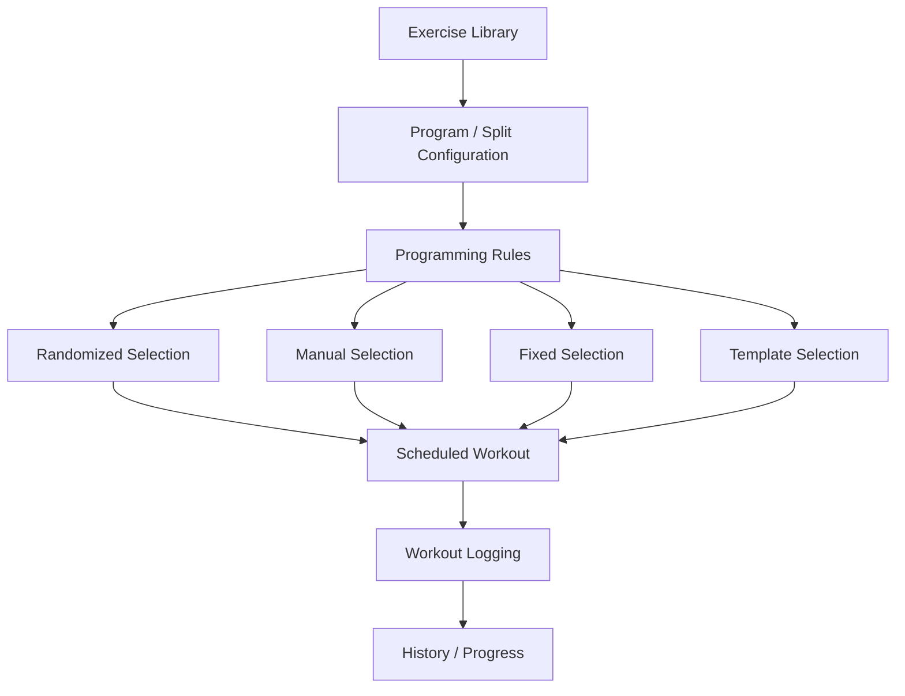
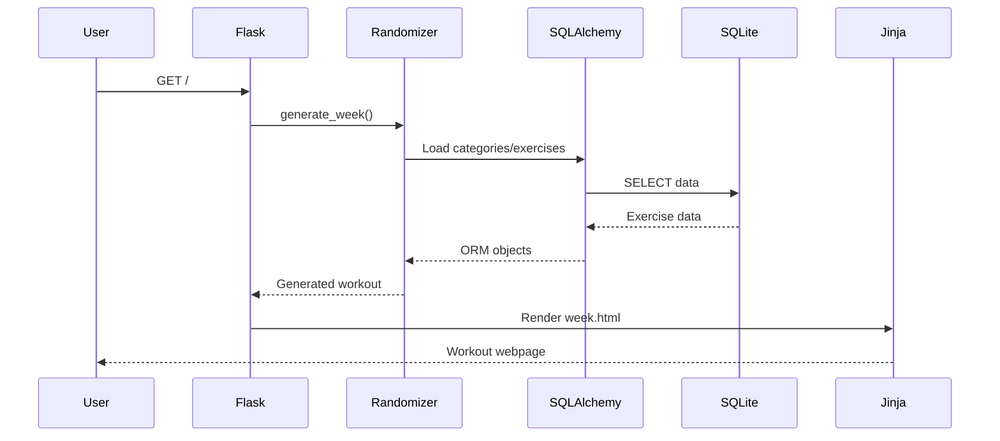
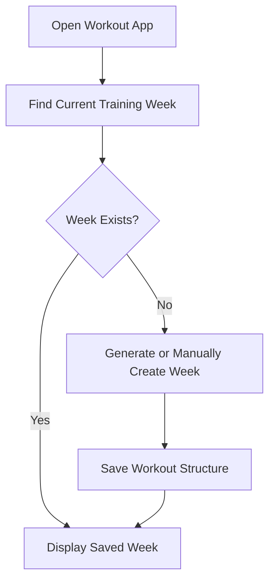

# Workout App — System Architecture

## Purpose

This document describes the high-level architecture of the Workout App and records important architectural decisions made during development.

The application is designed to support workout programming, scheduling, logging, and historical analysis without requiring every user to follow the same training methodology.

## Architectural Principles

### Programming and execution are separate concerns

One of the application's central design principles is the separation between:

**Programming**

> What workout should be created?

and:

**Execution / Persistence**

> What workout was actually scheduled or performed?

This prevents the persistence layer from becoming dependent on a specific workout split or programming methodology.

## High-Level Architecture



## Application Layers

### Presentation Layer

Current components:

* HTML
* CSS
* Jinja templates

Responsibilities:

* Display workouts
* Present exercise information
* Provide responsive desktop/mobile layouts
* Eventually collect workout and set information from users

The presentation layer should not contain workout programming or database logic.

### Web/Application Layer

Current framework:

* Flask

Responsibilities:

* Receive HTTP requests
* Route requests to appropriate application functionality
* Call application services
* Pass resulting data into templates
* Return rendered responses

Example:

```text
GET /
  ↓
Flask route
  ↓
Application service
  ↓
Database / randomizer
  ↓
Template
  ↓
HTML response
```

### Service Layer

The `services/` directory contains application logic that should remain separate from HTTP routes and database model definitions.

Current service:

```text
services/randomizer.py
```

Future services may include:

```text
services/workout_service.py
services/history_service.py
services/program_service.py
```

The exact service structure may evolve as functionality grows.

### Persistence Layer

SQLAlchemy provides the ORM between Python objects and the underlying relational database.

```text
Python Models
     ↓
SQLAlchemy
     ↓
SQLite
```

Alembic manages changes to the database schema over time.

## Programming Architecture

Workout randomization is a **programming mechanism**, not the identity of the application.

The intended long-term model is:



The system should eventually allow different programming methods to coexist.

For example:

```text
Push Day

1. Bench Press
   Fixed

2. Chest Press
   Randomized from Chest Press category

3. Fly
   Randomized from Fly category

4. Lateral Raise
   Randomized from Lateral Raise category

5. Triceps Extension
   Manually selected
```

The persistence layer should not care which mechanism selected an exercise.

Once scheduled, an exercise is simply a `WorkoutExercise`.

## Current Randomization Architecture

The current randomizer uses:

```text
Muscle Groups
      ↓
Categories
      ↓
Weekly Quotas
      ↓
Eligible Exercises
      ↓
Random Selection
      ↓
Day Distribution
      ↓
Validation
```

The current implementation contains a day-size configuration:

```python
DAY_SIZES = [5, 5, 4, 4]
```

This is currently an implementation detail of the first workout configuration.

It must **not** become a global database restriction.

Future development should allow program configuration to provide these types of rules to the randomization engine.

## Current Request Flow



This flow currently generates a new workout whenever the route is requested.

## Target Persistent Flow

The next stage changes the workflow to:



Refreshing the page should eventually load existing workout records rather than regenerating them.

## Manual Programming

Manual programming is considered a first-class future feature.

Users should eventually be able to:

* Create workout days
* Add exercises manually
* Remove exercises
* Reorder exercises
* Swap exercises
* Modify randomized workouts
* Build an entire split without using randomization

Automation should assist the user rather than remove user control.

## Workout Templates

Reusable templates are planned but are not required for the first persistence implementation.

Templates may eventually represent stable workout structures such as:

```text
Legs A

Quad Compound
Hamstring Curl
Leg Extension
Calf Movement
```

A specific week's workout could be created from this structure and then manually modified.

Templates should remain separate from historical workout records.

## Multi-User Considerations

The current application is single-user.

Future versions may support multiple users.

The architecture should therefore avoid assumptions that:

* Every user follows the same split
* Every user uses randomization
* Every user has the same number of workout days
* Every user shares identical exercise preferences
* Every user uses identical programming rules

Authentication and user ownership will be introduced only when multi-user functionality becomes an active development goal.

## Key Architectural Decision

The persistence layer stores **what was scheduled**.

The programming layer determines **what should be scheduled**.

This distinction should be preserved as the application evolves.