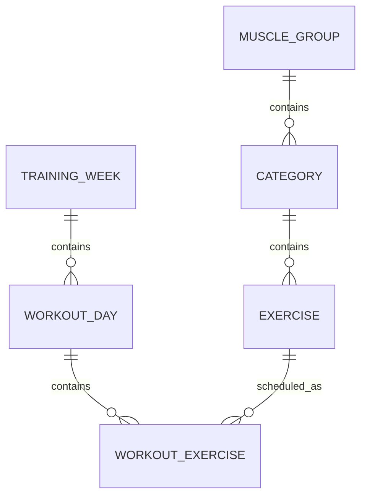

# Workout App — Database Design

## Purpose

This document describes the application's relational data model, table responsibilities, and important database design decisions.

The schema will evolve as workout logging, templates, configurable programs, and user accounts are introduced.

## Current Data Model

The current database contains two major conceptual areas:

1. Exercise Library
2. Workout Scheduling

## Entity Relationship Overview



## Exercise Library

### MuscleGroup

Table:

```text
muscle_groups
```

Purpose:

Represents broad anatomical/programming groups such as:

* Back
* Chest
* Shoulders
* Arms

Current fields:

```text
id
name
```

Relationship:

```text
MuscleGroup
    ↓ one-to-many
Category
```

### Category

Table:

```text
categories
```

Purpose:

Groups exercises according to their role in the current randomization system.

Examples include:

* Lats / Pulldowns
* Rows
* Incline Press
* Press
* Fly
* Lateral Raises
* Rear Delts
* Biceps
* Triceps

Current fields:

```text
id
name
weekly_quota
muscle_group_id
```

Relationship:

```text
MuscleGroup
    ↓
Category
    ↓
Exercise
```

`weekly_quota` currently defines how many exercises from the category should appear in a generated week.

This field supports the current randomization implementation and may eventually be replaced or supplemented by program-specific rules.

Long-term, randomization quotas should not necessarily be globally attached to a category because different programs may require different amounts of the same category.

### Exercise

Table:

```text
exercises
```

Purpose:

Stores canonical exercise definitions.

Current fields:

```text
id
name
active
category_id
```

`active` allows an exercise to be removed from future selection without deleting historical references to it.

This is important because an unavailable machine or discontinued exercise should not destroy workout history.

Relationship:

```text
Category
    ↓ one-to-many
Exercise
```

An exercise may also appear in many scheduled workouts:

```text
Exercise
    ↓ one-to-many
WorkoutExercise
```

## Workout Scheduling

### TrainingWeek

Table:

```text
training_weeks
```

Purpose:

Represents a specific scheduled training week.

Current fields:

```text
id
start_date
created_at
status
```

A training week does not define a particular split.

It may contain any number of workout days.

Examples:

```text
4-day Upper program
6-day Upper/Lower program
Push/Pull/Legs
Bro split
Fully manual program
```

The database should not enforce a universal number of days.

### WorkoutDay

Table:

```text
workout_days
```

Purpose:

Represents one workout session belonging to a training week.

Current fields:

```text
id
training_week_id
day_number
name
creation_method
```

Examples:

```text
Upper 1
Upper 2
Legs A
Push
Pull
Chest
Back
```

`creation_method` records how the workout was initially created.

Possible values currently envisioned include:

```text
randomized
manual
template
```

The field is informational at this stage and should not tightly couple persistence behavior to a programming method.

Relationship:

```text
TrainingWeek
    ↓ one-to-many
WorkoutDay
```

### WorkoutExercise

Table:

```text
workout_exercises
```

Purpose:

Represents an exercise scheduled within a particular workout day.

Current fields:

```text
id
workout_day_id
exercise_id
position
```

Relationship:

```text
WorkoutDay
    ↓
WorkoutExercise
    ↓
Exercise
```

`position` stores exercise order within the workout.

For example:

```text
WorkoutDay: Upper 1

position 1 → Pull ups
position 2 → Incline DB
position 3 → lateral raises (DB)
```

## Why WorkoutExercise References Exercise

Exercise information is not duplicated every time an exercise is scheduled.

Instead:

```text
WorkoutExercise.exercise_id
```

references:

```text
Exercise.id
```

For example:

```text
Exercise

id = 32
name = Incline DB
```

may be referenced by:

```text
Week 1 / Upper 1
Week 4 / Upper 2
Week 8 / Push
Week 10 / Chest
```

while maintaining a single canonical exercise definition.

## Cascading Relationships

Current parent-child relationships use SQLAlchemy cascading where appropriate:

```text
TrainingWeek
    ↓
WorkoutDay
    ↓
WorkoutExercise
```

Deleting a scheduled week may therefore remove its associated scheduled days and workout-exercise records.

It must **not** delete canonical `Exercise` records.

Exercise library records exist independently from any particular scheduled workout.

## Scheduled vs. Performed Data

The current persistence schema primarily answers:

> What was scheduled?

It does not yet fully answer:

> What was actually performed?

Future set logging will introduce additional records below `WorkoutExercise`.

Conceptually:

```text
WorkoutExercise
      ↓
PerformedSet
      ↓
weight
reps
set_number
```

For example:

```text
lateral raises (DB)

Set 1
15 × 10

Set 2
20 × 6
```

Keeping scheduled exercise data separate from performed set data allows workout planning and workout execution to be modeled independently.

## Future Program Configuration

The current category `weekly_quota` is sufficient for the first randomizer but is unlikely to represent the final programming model.

A future schema may introduce concepts such as:

```text
Program
    ↓
ProgramDay
    ↓
ProgramRule / ProgramSlot
```

A rule might specify:

```text
Category: Chest Press
Quantity: 1
Selection Mode: Randomized
```

or:

```text
Exercise: Bench Press
Selection Mode: Fixed
```

This would allow the same exercise library and randomization engine to support different training splits.

These tables should not be introduced until configurable programming becomes an active development feature.

## Future Template Model

Reusable workout templates may eventually exist separately from actual scheduled workouts.

Conceptually:

```text
WorkoutTemplate
      ↓
TemplateSlot
```

A template is a reusable programming definition.

A `WorkoutDay` is an actual scheduled workout.

This distinction should be maintained so that modifying a future template does not rewrite historical workouts.

## Future User Ownership

Multi-user functionality will eventually require ownership relationships.

Possible future relationships include:

```text
User
 ├── Exercises / Preferences
 ├── Programs
 ├── Templates
 └── TrainingWeeks
```

User-specific schema decisions should be deferred until authentication and multi-user functionality are actively implemented.

## Migration Management

Database schema changes are managed with Alembic.

The database began with:

```text
muscle_groups
categories
exercises
```

An Alembic baseline was then established for the existing schema.

Subsequent schema changes are represented as migrations.

Typical workflow:

```bash
alembic revision --autogenerate -m "description of change"
```

Review the generated migration before applying it.

Then:

```bash
alembic upgrade head
```

Check the current revision with:

```bash
alembic current
```

Migration files should be committed to Git.

The local SQLite database itself should not be committed.