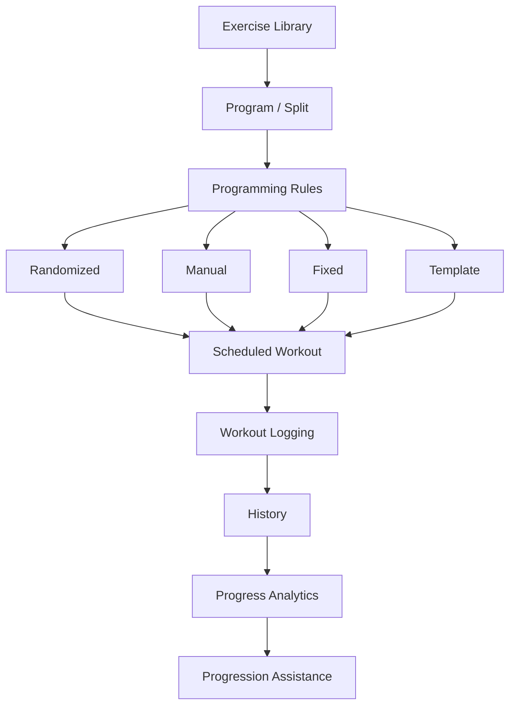

# Workout App — Development Roadmap

## Purpose

This roadmap records completed functionality, immediate development goals, and longer-term product ideas.

It is intended as a direction rather than a rigid schedule.

Architecture and implementation details may change as the application develops.

---

# Phase 1 — Exercise Library & Randomizer

## Status: Complete

Implemented:

* [x] Python project structure
* [x] Virtual environment
* [x] Flask application
* [x] SQLite database
* [x] SQLAlchemy integration
* [x] MuscleGroup model
* [x] Category model
* [x] Exercise model
* [x] Exercise seed data
* [x] Database-backed exercise selection
* [x] Category quotas
* [x] Duplicate exercise prevention
* [x] Workout distribution scoring
* [x] Randomized weekly workout generation
* [x] Generated workout validation
* [x] Flask/Jinja workout rendering
* [x] Responsive desktop/mobile layout

Current randomization implementation uses a four-day `[5, 5, 4, 4]` structure.

This represents the first supported program configuration, not a permanent application restriction.

---

# Phase 2 — Workout Persistence

## Status: In Progress

Implemented:

* [x] Alembic installation and configuration
* [x] Existing database baseline
* [x] Migration workflow
* [x] TrainingWeek model
* [x] WorkoutDay model
* [x] WorkoutExercise model
* [x] Workout persistence migration

Next:

* [ ] Create workout persistence service
* [ ] Save generated workouts
* [ ] Load saved/current training week
* [ ] Stop regenerating workouts on browser refresh
* [ ] Add Generate Week action
* [ ] Define current-week behavior

Target flow:

```text
Generate Workout
       ↓
Validate
       ↓
Save
       ↓
Display
       ↓
Refresh
       ↓
Load Same Workout
```

---

# Phase 3 — Manual Workout Programming

## Status: Planned

Goals:

* [ ] Add workout days manually
* [ ] Rename workout days
* [ ] Add exercises manually
* [ ] Remove scheduled exercises
* [ ] Swap exercises
* [ ] Reorder exercises
* [ ] Modify randomized workouts
* [ ] Support variable numbers of workout days

This phase will allow the application to represent the complete training split rather than only randomized workouts.

A key initial use case is adding two manually managed leg days alongside randomized upper-body days.

The persistence layer must remain agnostic to whether a workout was generated or manually created.

---

# Phase 4 — Workout Logging

## Status: Planned

Goals:

* [ ] Mark workouts as performed
* [ ] Enter working/top sets
* [ ] Store weight
* [ ] Store repetitions
* [ ] Associate sets with scheduled exercises
* [ ] Store workout dates
* [ ] Optional workout/exercise notes

Initial set structure:

```text
Exercise

Top Set 1
Weight × Reps

Top Set 2
Weight × Reps
```

The data model should eventually allow additional sets without requiring a major redesign.

---

# Phase 5 — Previous Performance

## Status: Planned

Goals:

* [ ] Show previous performance when an exercise appears
* [ ] Display previous weights and repetitions
* [ ] Show most recent workout date
* [ ] Provide exercise history

Example:

```text
lateral raises (DB)

Previous
15 × 10
20 × 6

Today
[weight] × [reps]
[weight] × [reps]
```

---

# Phase 6 — Workout Templates

## Status: Future

Goals:

* [ ] Create reusable workout templates
* [ ] Create workout days from templates
* [ ] Modify a generated instance without modifying the template
* [ ] Support stable workout structures with variable movements

Example:

```text
Legs A Template

1. Quad Compound
2. Hamstring Curl
3. Leg Extension
4. Calf Movement
```

A week's workout could instantiate this template and then substitute specific machines or movements.

---

# Phase 7 — Configurable Programs & Splits

## Status: Future

Goal:

Move workout structure and randomization rules out of hard-coded application logic.

Possible concepts:

```text
Program
    ↓
ProgramDay
    ↓
ProgramRule / ProgramSlot
```

Programs might include:

```text
Upper / Lower
Push / Pull / Legs
Bro Split
Full Body
Custom Split
```

The user should define the structure rather than the application assuming one.

---

# Phase 8 — Generic Randomization Engine

## Status: Future

The current randomizer proves the exercise-selection concept.

Eventually, randomization should operate on program-defined rules.

Example:

```text
Push Day

Chest Press
quantity = 2
mode = randomized

Chest Fly
quantity = 1
mode = randomized

Overhead Press
quantity = 1
mode = fixed

Triceps
quantity = 2
mode = randomized
```

The randomization engine would select exercises from eligible exercise pools according to those rules.

Potential selection modes:

```text
Randomized
Manual
Fixed
Template
```

These modes may coexist within the same workout.

---

# Phase 9 — Exercise Library Management

## Status: Future

Goals:

* [ ] Add exercises through the UI
* [ ] Edit exercises
* [ ] Disable exercises
* [ ] Create categories
* [ ] Edit categories
* [ ] Manage exercise classifications
* [ ] Potentially support user-created exercises

Longer-term consideration:

A multi-user version may distinguish between a default/shared exercise catalog and user-specific exercises or preferences.

---

# Phase 10 — History & Progress Analytics

## Status: Future

Goals:

* [ ] Exercise history
* [ ] Workout history
* [ ] Weight progression
* [ ] Rep progression
* [ ] Volume trends
* [ ] Progress charts
* [ ] Personal records
* [ ] Training consistency metrics

Example:

```text
Lateral Raises (DB)

08/26   15×10   20×6
08/12   15×9    20×5
07/29   15×8    20×5
```

---

# Phase 11 — Progression Assistance

## Status: Future

Potential functionality:

* [ ] Suggested weight increases
* [ ] Suggested repetition targets
* [ ] Configurable progression rules
* [ ] Plateau identification

Progression rules should be configurable rather than based on arbitrary hard-coded assumptions.

---

# Phase 12 — Multi-User Support

## Status: Future

Potential functionality:

* [ ] User accounts
* [ ] Authentication
* [ ] User-owned training programs
* [ ] User-owned workout history
* [ ] User exercise preferences
* [ ] Independent programming strategies

Different users should be able to use the application differently.

For example:

```text
User A
Upper / Lower
Mostly randomized

User B
Push / Pull / Legs
Fully manual

User C
Bro Split
Template-based with randomized accessories
```

All should ultimately use the same workout scheduling and logging foundation.

---

# Phase 13 — Deployment

## Status: Future

Goals:

* [ ] Host application remotely
* [ ] Mobile browser access
* [ ] Production database
* [ ] Secure configuration
* [ ] HTTPS
* [ ] Backups
* [ ] Production monitoring

A move from SQLite to a server-based database such as PostgreSQL may occur during this phase depending on requirements.

---

# Long-Term Product Flow



# Guiding Product Principle

Automation should assist programming without taking control away from the user.

A randomized workout should always be editable.

A manually created workout should not require randomization.

A template should be reusable without rewriting workout history.

And the persistence/history system should work regardless of how the workout was originally created.