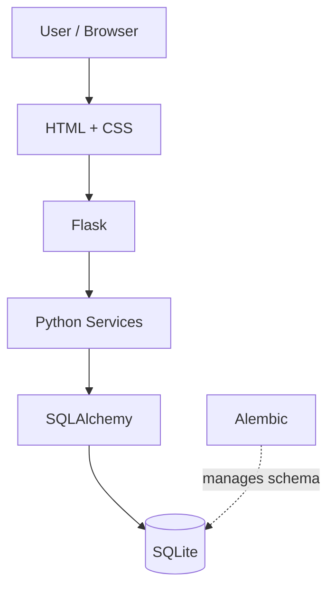

# Workout App — Technology Stack

## Overview

The Workout App uses a deliberately lightweight technology stack suitable for learning, local development, and the application's current scale.

The stack can evolve as deployment, multi-user access, and production requirements become relevant.

---

# Technology Stack

## Python

**Role:** Primary application language

Python is used for:

* Application logic
* Workout randomization
* Database interactions
* Flask routes
* Persistence services
* Future workout analysis

Python was chosen because the original workout randomizer was written in Python and because its ecosystem provides mature web and database tooling.

---

## Flask

**Role:** Web application framework

Flask handles:

* HTTP requests
* URL routing
* Calling application services
* Template rendering
* Returning responses to the browser

Current example flow:

```text
Browser
   ↓
Flask Route
   ↓
Python Service
   ↓
Jinja Template
   ↓
Browser
```

Flask provides enough structure for the application without requiring a large framework.

---

## Jinja

**Role:** Server-side HTML templating

Jinja is Flask's template system.

It allows Python data to be rendered dynamically into HTML.

Examples include:

```text
Workout days
Exercise names
Muscle groups
Categories
Exercise counts
```

Jinja syntax commonly uses:

```text
{{ value }}
```

to display values and:

```text

```

for template logic such as loops.

---

## HTML

**Role:** User-interface structure

HTML defines the structure of the application's pages.

Current UI elements include:

* Page headers
* Workout cards
* Exercise lists
* Exercise metadata

Future HTML interfaces will include:

* Forms
* Buttons
* Exercise selectors
* Workout editors
* Set logging controls
* History views

---

## CSS

**Role:** Styling and responsive layout

CSS controls:

* Layout
* Spacing
* Typography
* Workout cards
* Responsive behavior

The current interface uses media queries so the workout layout changes between desktop and smaller/mobile screens.

---

## SQLAlchemy

**Role:** Object-Relational Mapper (ORM)

SQLAlchemy provides the interface between Python and the relational database.

Instead of writing SQL for every application operation, Python models represent database entities.

Example:

```text
Python Exercise object
        ↓
SQLAlchemy
        ↓
exercises table
```

Current ORM models include:

```text
MuscleGroup
Category
Exercise
TrainingWeek
WorkoutDay
WorkoutExercise
```

SQLAlchemy relationships also describe connections between these entities.

---

## SQLite

**Role:** Current relational database

SQLite stores application data in a local database file:

```text
workout.db
```

Current stored data includes:

* Muscle groups
* Exercise categories
* Exercises
* Training weeks
* Workout days
* Scheduled workout exercises

SQLite was selected because it:

* Requires no separate database server
* Works well for local development
* Integrates easily with SQLAlchemy
* Is sufficient for the application's current scale

If the application eventually becomes a hosted multi-user service, migration to a server-based relational database such as PostgreSQL may be considered.

The ORM architecture should make such a transition easier.

---

## Alembic

**Role:** Database schema migration management

Alembic tracks changes to the database structure.

Examples include:

```text
Adding tables
Adding columns
Changing relationships
Adding indexes
```

Without migrations, schema development might require deleting and recreating the database.

That becomes unacceptable once the database contains real workout history.

Alembic allows the schema to evolve while preserving data.

Migration workflow:

```text
Modify SQLAlchemy models
        ↓
Generate migration
        ↓
Review migration
        ↓
Apply migration
        ↓
Database updated
```

---

## Python `venv`

**Role:** Isolated Python environment

The project uses:

```text
.venv/
```

to isolate Python packages from the system Python installation.

The virtual environment is disposable and should not be committed to Git.

It can be recreated using:

```bash
python3 -m venv .venv
```

---

## pip

**Role:** Python package management

`pip` installs Python dependencies.

Dependencies are recorded in:

```text
requirements.txt
```

This allows the environment to be reconstructed without committing `.venv`.

Install dependencies with:

```bash
python -m pip install -r requirements.txt
```

---

## Git

**Role:** Source control

Git tracks changes to source code and project documentation.

The repository root currently contains multiple development projects, with the Workout App living under:

```text
Coding/
└── workout_app/
```

The default branch is:

```text
main
```

Files such as the following should not be committed:

```text
.venv/
workout.db
__pycache__/
.env
.DS_Store
```

---

## GitHub

**Role:** Remote source-code hosting

GitHub stores the remote Git repository and provides:

* Remote backup of source history
* Repository browsing
* Markdown rendering
* Mermaid diagram rendering
* Future collaboration capabilities

Project documentation is intentionally written in Markdown so it can be read directly through GitHub.

---

# Current Technology Flow



---

# Possible Future Technologies

These are not current dependencies and should not be introduced until there is a concrete need.

## PostgreSQL

Possible future replacement for SQLite if the application becomes a hosted multi-user service.

## JavaScript / HTMX

May provide more interactive interfaces without requiring full page reloads.

Potential uses:

* Exercise swapping
* Set entry
* Workout editing
* Reordering exercises

## Authentication

A future authentication system will be required if multiple users have independent workout data.

No authentication technology has been selected yet.

## Hosting / Cloud Infrastructure

Production hosting has intentionally not been selected yet.

Deployment architecture should be designed when remote/mobile access becomes an active development goal.

---

# Technology Selection Principle

New technologies should be added when they solve a concrete application problem.

The project should avoid adding infrastructure simply because it may become useful someday.

The preferred approach is:

```text
Need
 ↓
Design
 ↓
Choose technology
 ↓
Implement
```

rather than:

```text
Technology
 ↓
Find something to use it for
```